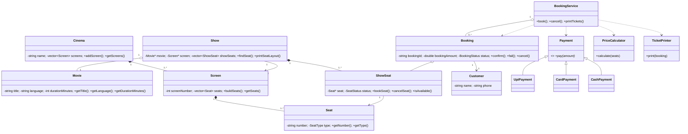

# Class Diagram

The complete UML source is [`class-diagram.puml`](class-diagram.puml).

```mermaid
classDiagram
class Movie { -string title; -string language; -int durationMinutes; +getTitle(); +getLanguage(); +getDurationMinutes() }
class Seat { -string number; -SeatType type; +getNumber(); +getType() }
class Screen { -int screenNumber; -vector~Seat~ seats; +buildSeats(); +getSeats() }
class Cinema { -string name; -vector~Screen~ screens; +addScreen(); +getScreens() }
class Show { -Movie* movie; -Screen* screen; -vector~ShowSeat~ showSeats; +findSeat(); +printSeatLayout() }
class ShowSeat { -Seat* seat; -SeatStatus status; +bookSeat(); +cancelSeat(); +isAvailable() }
class Customer { -string name; -string phone }
class Booking { -string bookingId; -double bookingAmount; -BookingStatus status; +confirm(); +fail(); +cancel() }
class Payment { <<abstract>> +pay(amount)* }
class UpiPayment
class CardPayment
class CashPayment
class PriceCalculator { +calculate(seats) }
class TicketPrinter { +print(booking) }
class BookingService { +book(); +cancel(); +printTickets() }
Cinema "1" *-- "1..*" Screen
Screen "1" *-- "1..*" Seat
Show "1" o-- "1" Movie
Show "1" --> "1" Screen
Show "1" *-- "1..*" ShowSeat
ShowSeat "1" --> "1" Seat
Booking "1" --> "1" Customer
Booking "1" o-- "1..*" ShowSeat
BookingService "1" o-- "0..*" Booking
Payment <|-- UpiPayment
Payment <|-- CardPayment
Payment <|-- CashPayment
BookingService ..> Payment
BookingService ..> PriceCalculator
BookingService ..> TicketPrinter
BookingService ..> Booking
```

Notation used: `*--` composition, `o--` aggregation, `-->` association, and `<|--` inheritance.
